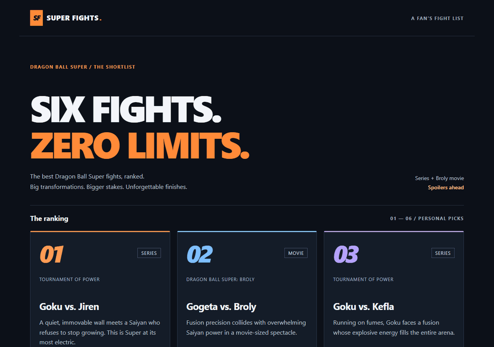

# WEB103 Project 1 - *Dragon Ball Super: Ultimate Battles*

Submitted by: **Brian Ingram**

About this web app: **Dragon Ball Super: Ultimate Battles is a fan-made ranking of six memorable fights from the series and Dragon Ball Super: Broly. Browse fight cards with scene snapshots, then open each fight’s own page to explore the fighters, story arc, location, standout moment, outcome, ranking explanation, and an embedded English-dub video. Goku vs. Kefla takes the number-one spot.**

Time spent: **13** hours

## Required Features

The following **required** functionality is completed:

- [x] **The web app uses only HTML, CSS, and JavaScript without a frontend framework**
- [x] **The web app displays a title**
- [x] **The web app displays at least five unique list items, each with at least three displayed attributes (such as title, text, and image)**
- [x] **The user can click on each item in the list to see a detailed view of it, including all database fields**
  - [x] **Each detail view should be a unique endpoint, such as `localhost:3000/fights/goku-vs-kefla` and `localhost:3000/fights/gogeta-vs-broly`**
  - [x] *Note: When showing this feature in the video walkthrough, please show the unique URL for each detailed view. We will not be able to give points if we cannot see the implementation.*
- [x] **The web app serves an appropriate 404 page when no matching route is defined**
- [x] **The web app is styled using Picocss**

The following **optional** features are implemented:

- [x] The web app displays items in a unique format, such as cards rather than lists or animated list items

The following **additional** features are implemented:

- [x] Fight snapshots appear on the ranking cards and detail pages, with image sources credited.
- [x] English-dub fight videos play inside responsive embedded players.
- [x] The layout adapts to desktop and mobile screens.
- [x] Keyboard navigation includes visible focus states and a skip-to-content link.
- [x] Failed data requests display a retry button.
- [x] The previous Vegeta vs. Toppo URL redirects to the renamed Vegeta vs. Top page.
- [x] The app uses a custom Dragon Ball-inspired logo and browser icon.

## Video Walkthrough

Here's a walkthrough of implemented required features:

GIF created with **Microsoft Edge window captures and Python Pillow**.

The walkthrough shows the current logo and cover images, all six fight cards, every unique detail URL in the browser address bar, the embedded English-dub player, detailed fight attributes, and the custom 404 page with navigation back home.

## Notes

The backend uses Express to serve static HTML pages, public assets, and JSON endpoints. Fight records currently live in a JavaScript array with shared fields; a database is planned for Unit 2.

A challenge was finding English-dub videos that permit embedded playback. The selected videos were observed playing inside localhost pages, and playback also works in Edge. The in-app preview browser has intermittently displayed blank players. These are third-party streams, so internet access and continued uploader availability are required; some clips show highlights rather than complete fights.

The ranking is subjective and detail pages contain spoilers. Dragon Ball characters, scene images, and videos belong to their respective owners. The license below covers original project code, not third-party media.

Setup commands, route descriptions, and development details are in [SETUP.md](SETUP.md). Run `npm install`, then `npm start`, and open `http://localhost:3000`. Run `npm test` for route, API, asset, and 404 checks.

## License

Copyright 2026 Brian Ingram

Licensed under the Apache License, Version 2.0 (the "License"); you may not use this file except in compliance with the License. You may obtain a copy of the License at

> http://www.apache.org/licenses/LICENSE-2.0

Unless required by applicable law or agreed to in writing, software distributed under the License is distributed on an "AS IS" BASIS, WITHOUT WARRANTIES OR CONDITIONS OF ANY KIND, either express or implied. See the License for the specific language governing permissions and limitations under the License.

