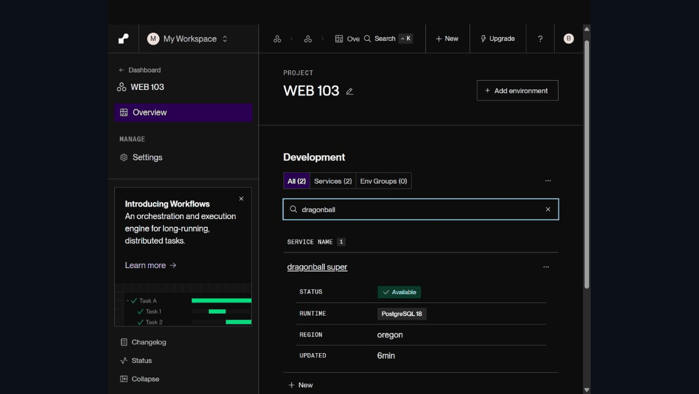

# WEB103 Project 2 - *Dragon Ball Super: Ultimate Battles*

Submitted by: **Brian Ingram**

About this web app: **A ranking of six Dragon Ball Super fights with scene snapshots, unique detail pages, and embedded English-dub videos. Project 2 moves the fight records into PostgreSQL and adds case-insensitive search by title, fighter, story arc, or format.**

Time spent: **8** hours

## Required Features

The following **required** functionality is completed:

- [x] **The web app uses only HTML, CSS, and JavaScript without a frontend framework**
- [x] **The web app is connected to a PostgreSQL database, with an appropriately structured database table for the list items**
  - [x] **NOTE: Your walkthrough added to the README must include a view of your Render dashboard demonstrating that your Postgres database is available**
  - [x] **NOTE: Your walkthrough added to the README must include a demonstration of your table contents. Use the psql command 'SELECT * FROM tablename;' to display your table contents.**

The following **optional** features are implemented:

- [x] The user can search for items by a specific attribute

The following **additional** features are implemented:

- [x] Search supports fight title, fighter, story arc, and series/movie format.
- [x] Search URLs can be bookmarked, and browser Back/Forward restores filters.
- [x] Queries use SQL parameters, validated attributes, and literal search text.
- [x] Schema and seed setup runs in a transaction and can be repeated without duplicating records.
- [x] Database outages return HTTP 503 with a retry option instead of exposing connection details.
- [x] Existing ranked cards, fight images, English-dub players, mobile layout, and custom 404 pages are retained.

## Video Walkthrough

Here's a walkthrough of implemented required features:

GIF created with **browser screenshots and Python Pillow**. The database portion displays the actual output captured from the `psql` client running `SELECT * FROM fights;` against Render, formatted as a readable transcript. The [full query output](docs/postgres-table.txt) and [Render dashboard screenshot](docs/render-database.png) are also included.

[Direct GIF link](https://raw.githubusercontent.com/BIngram17/dragon-ball-super-ultimate-battles/main/docs/project2-walkthrough.gif)

## Notes

The app now queries PostgreSQL through an Express backend using `pg`. The six original records are seed data only; normal runtime routes never read the seed array. The schema stores the fighters as a PostgreSQL text array and enforces unique ranks and slugs.

Automated tests execute the schema and SQL against isolated embedded PostgreSQL using PGlite. They verify repeat seeding, attribute searches, literal wildcard handling, live database edits through the API, valid routes, and safe 404/503 responses. The live Render PostgreSQL 18 connection was also verified: the table contains all six records, the app API returns them in rank order, and the live movie filter returns Gogeta vs. Broly. The free Render database expires October 23, 2026.

See [SETUP.md](SETUP.md) for database setup and verification. The [Project 1 README](docs/project1-readme.md) preserves the earlier submission.

Dragon Ball characters, images, and videos belong to their respective owners. The license below applies to original project code, not third-party media.

## License

Copyright 2026 Brian Ingram

Licensed under the Apache License, Version 2.0 (the "License"); you may not use this file except in compliance with the License. You may obtain a copy of the License at

> http://www.apache.org/licenses/LICENSE-2.0

Unless required by applicable law or agreed to in writing, software distributed under the License is distributed on an "AS IS" BASIS, WITHOUT WARRANTIES OR CONDITIONS OF ANY KIND, either express or implied. See the License for the specific language governing permissions and limitations under the License.

